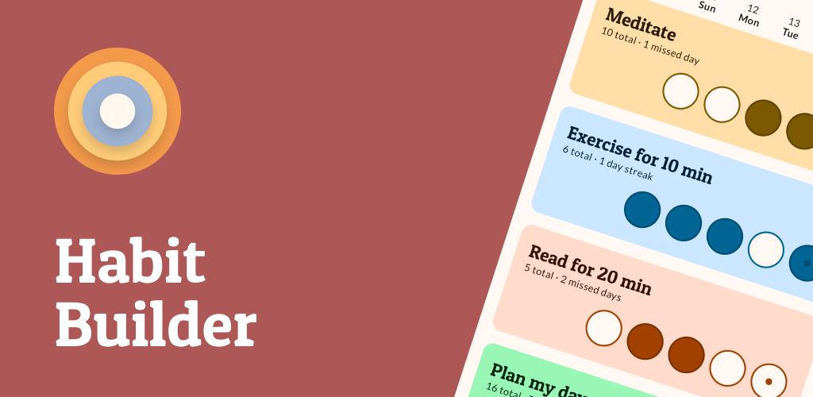
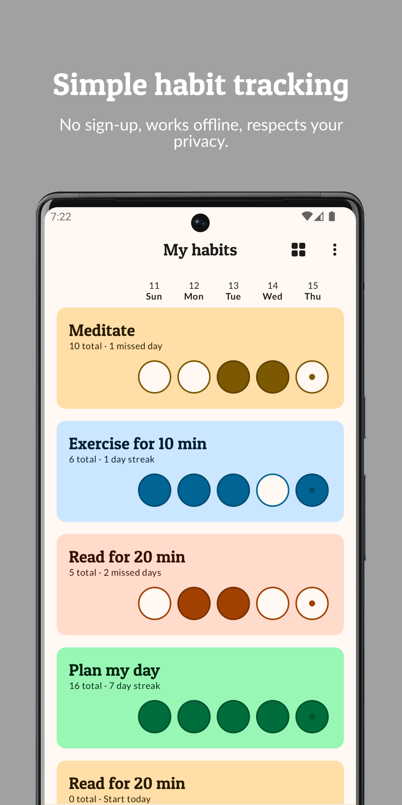
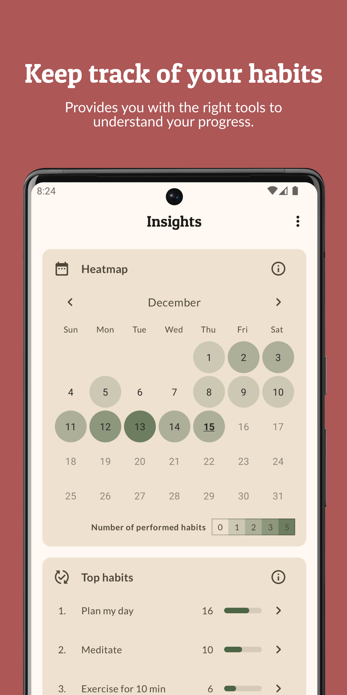
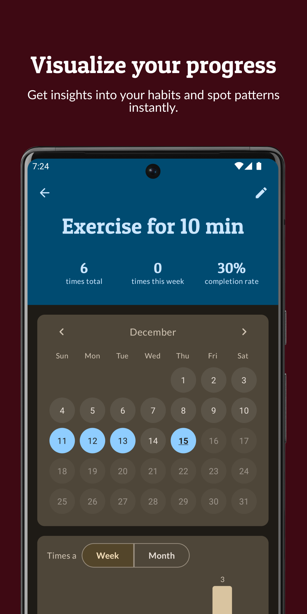
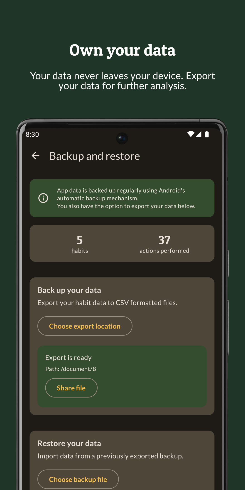

# Habit Builder [](https://app.bitrise.io/app/956ea5e751ec6be4)

[</img>](https://play.google.com/store/apps/details?id=com.ofalvai.habittracker)



|   |   |   |   |
|---|---|---|---|
|  |  |  |  |

## Motivation

I needed a simple and minimal habit tracking app, so I decided to create my own.

This project is also a testing ground for new technologies I'd like to explore.

## Features

- Keep track of new habits and see your progress
- Statistics: aggregate and per-habit stats
  - Per-habit: completion rate, weekly and overall count, streaks
  - Overall: calendar heatmap, top habits, top days for habits
- Customizable habit list layout, reorderable list
- All data is persisted on-device in a database
- Export, import, archiving of old items

## 🛠 Built with

- [Compose-only](https://developer.android.com/jetpack/compose) UI:
    - Based on Material3, supports dynamic color
    - Light and dark theme
    - Smooth and delightful animations
    - No AppCompat dependency, single Activity
- [Room](https://developer.android.com/training/data-storage/room): for storing data locally
- [Kotlin Coroutines](https://kotlinlang.org/docs/coroutines-overview.html) + [Flow](https://kotlinlang.org/docs/flow.html): for async operations
- Testing:
    - Unit tests for most of the business logic (ViewModels, mappings, etc.)
    - Instrumented tests for DB operations
    - UI tests for some Compose screens
    - Kotlin Flow testing with [Turbine](https://github.com/cashapp/turbine)
- [Showkase](https://github.com/airbnb/Showkase): UI component browser in debug builds
- Other interesting bits and integrations:
    - Modular codebase according to best practices
    - [Gradle convention plugins](https://github.com/ofalvai/HabitTracker/tree/main/build-logic) for configuring modules
    - [Licensee](https://github.com/cashapp/licensee): 3rd party dependency validation, license report JSON for the Licenses screen
    - [Ruler](https://github.com/spotify/ruler): a Gradle plugin that measures app size and libraries contributing to it
    - [Gradle version catalog](https://github.com/ofalvai/HabitTracker/blob/main/gradle/libs.versions.toml)
    - [Renovate](https://github.com/ofalvai/HabitTracker/issues/10): Automating dependency update PRs (works with Gradle version catalogs!)
    - [Gradle dependency analysis](https://github.com/autonomousapps/dependency-analysis-android-gradle-plugin): For automatically detecting unused dependencies and other common mistakes

## Development

### Useful Gradle tasks

- `analyzeReleaseBundle`: Run Spotify Ruler
- `licenseeRelease`: Run license check and generate `app/build/reports/licensee/release/artifacts.json`, which should be copied over to `assets/licenses.json` for the Licenses screen
- `assembleRelease -Phabittracker.enableComposeCompilerReports=true`: Write Compose compiler metrics to `$module/build/compose_metrics`
- `buildHealth`: Run dependency analysis (looking for unused dependencies, incorrect module structure)

## License

```
   Copyright 2023 Olivér Falvai

   Licensed under the Apache License, Version 2.0 (the "License");
   you may not use this file except in compliance with the License.
   You may obtain a copy of the License at

       http://www.apache.org/licenses/LICENSE-2.0

   Unless required by applicable law or agreed to in writing, software
   distributed under the License is distributed on an "AS IS" BASIS,
   WITHOUT WARRANTIES OR CONDITIONS OF ANY KIND, either express or implied.
   See the License for the specific language governing permissions and
   limitations under the License.
```